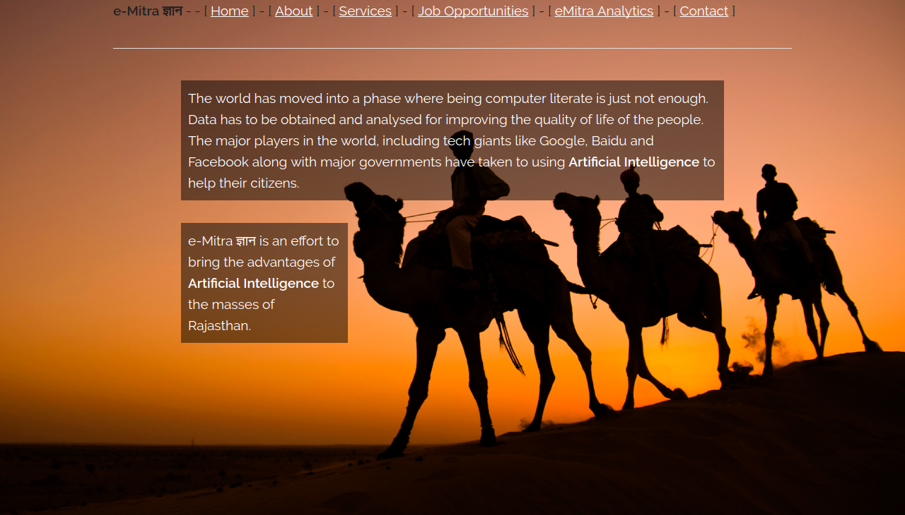
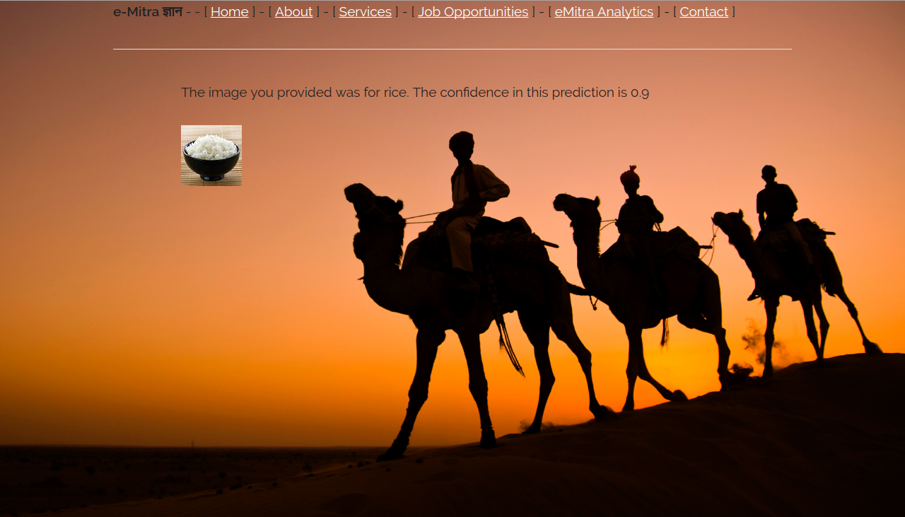

e-mitra Gyaan
=============

Providing AI services to the masses of Rajasthan.

The concept is to include a new service in e-Mitra which allows people to make
use of AI for their everyday needs. We utilize the advances in AI over the
years to attain superhuman performance in various tasks like image classification.

First we collect data from the people, thus generating employment as `data
labellers`. This is an essential step. Once the data is collected we perform
analysis on it and create a training dataset to train our AI on.

Once enough data has been collected, we train an AI model on it. The model can
be tuned to maximize [Accuracy / Precision or
Recall](https://en.wikipedia.org/wiki/Precision_and_recall) as needed. The
predictions of this model are provided as a service to the people via e-Mitra.

Since data underpins this technology, we demonstrate a simple case due to lack
of the employment phase. In this we perform two tasks:

1. Given an image, recognize if it contains `rice` or `wheat`.
2. Given seed details, recognize what kind of a wheat seed it is?

Visit <https://arjoonn.pythonanywhere.com> for a live demo.

The code is available at <https://github.com/theSage21/emitra-gyaan>

Predictions
-----------

As an example images uploaded to the site can be classified into `rice` or `wheat` categories.

Impacts
-------

The expertise of an expert is only available to a small group of people. By
mapping their expertise to an AI system we can provide those expertise to a
wider range of people. This will help Rajasthan to grow well.

This system also provides employment opportunities which do not require skill
and knowledge in some cases.

With the help of this system, people across the state can optimize their daily
workflows and activities to increase productivity across the state.

Walkthrough of website
------------

1. [Home](https://arjoonn.pythonanywhere.com/)
    - Landing page. Nothing to discuss
2. [About](https://arjoonn.pythonanywhere.com/about)
    - About the idea
3. [Services](https://arjoonn.pythonanywhere.com/services)
    - Two services are available as of now.
        1. Detect the presence of wheat / rice in images. This is illustrative of the power of machine learning. A similar classification can be made for classifying seeds as "will produce good crop" and "will produce bad crop"
        2. Detecting wheat seed type (Kama, Rosa and Canadian) based on the data provided by the user in a form. This illustrates another power of Machine learning, namely the cheap reproduction of decisions that people have to make.
    - It is recommended that you go a Google image search for `wheat` and provide an image with some wheat in it to the first form.
4. [Jobs](https://arjoonn.pythonanywhere.com/jobs)
    - Jobs are provided to label existing data
5. [Analytics](http://arjoonn.pythonanywhere.com/analytics)
    - This provides analysis of the current usage of eMitra across districts.
    - It shows which states are good targets for future expansion (those with high amount of bills and low usage)
6. [Contact](http://arjoonn.pythonanywhere.com/analytics)
    - Contact page

Demo Video
----------

<https://youtu.be/sGF_uNQ1pxw>

Explaining the Folders in code tree
----------------------

- docs: Docs provided to us for APIs
- images: images used to train the classifiers
- notebooks: Analysis notebooks
- static: static files
- templates: templates for pages

